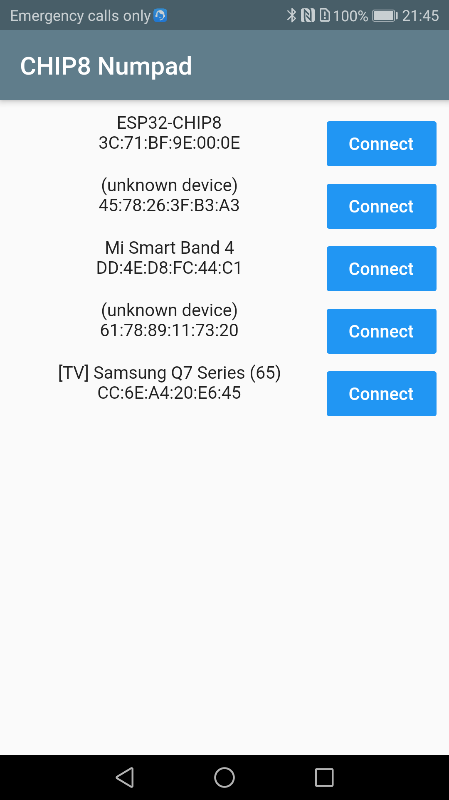
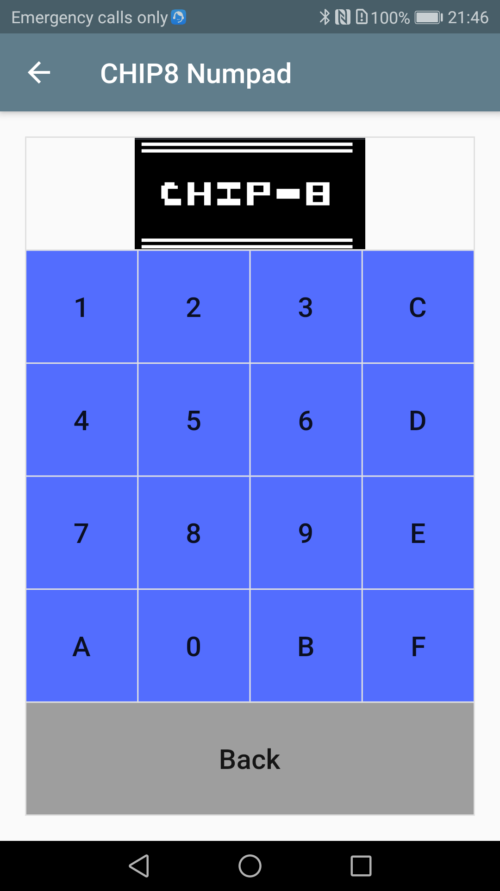

# Chip8 Numpad

A simple CHIP8 numpad Bluetooth low energy App that I used to give inputs to my [ESP32-CHIP8]().
The app first scans for available bluetooth devices and then the user can select the correct ESP32 CHIP8 device.  

  
   

